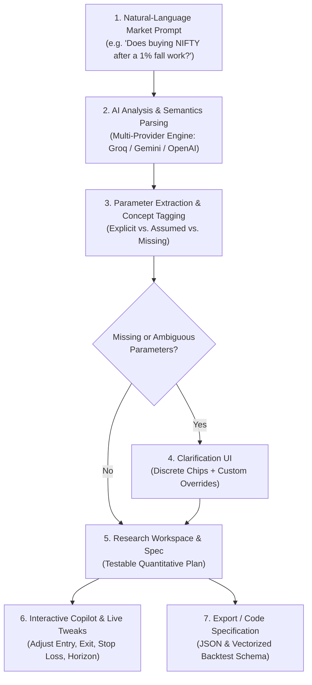

# 📈 TradeAI — AI Trading Research Assistant

> **"Turn a market question into a structured, testable quantitative experiment."**

A production-grade, full-stack Next.js prototype designed for quantitative researchers and systematic traders. It translates conversational market hypotheses into mathematically sound, unambiguous backtesting specifications by extracting parameters, identifying missing variables, and actively clarifying ambiguities.

[-emerald.svg)](./SECURITY_AUDIT.md)
[](https://www.typescriptlang.org/)
[](https://nextjs.org/)
[](https://tailwindcss.com/)

---

## 🚀 Overview

Traders and quantitative researchers frequently ask qualitative market questions (e.g., *"Does buying NIFTY after a sharp fall work?"* or *"Does buying the dip work better during high volatility?"*).

Translating these ideas into quantitative tests usually suffers from two major failure modes:
1. **Silent Parameter Invention:** Systems blindly guess critical parameters (e.g., guessing that "sharp fall" = 1% or picking an arbitrary holding horizon without consent).
2. **Ambiguity Overload:** Systems either reject vague questions entirely or accept them without enforcing testability.

**TradeAI** bridges conversational language to structured experimentation with rigorous product thinking:
- **Discovers & Parses:** Structured entity and concept extraction (instruments, indicators, market conditions).
- **Distinguishes:** Clearly separates what the user explicitly stated vs. what was assumed vs. what is missing.
- **Clarifies:** Interactively prompts for ambiguities with discrete quantitative choices and custom override capabilities.
- **Compiles:** Produces standardized experiment specifications ready for historical simulation engines (Backtrader, VectorBT, QuantConnect).
- **Real-Time Copilot Workspace:** Interactive refinement workspace with word-by-word streaming suggestions, parameter overrides, and markdown export.

---

## 🔄 Research Workflow



---

## 🏗️ Project Architecture

```
├── app/
│   ├── layout.tsx              # Root shell, fonts (Urbanist & Roboto), meta tags
│   ├── page.tsx                # Hero section, sample prompts, methodology guide
│   ├── results/
│   │   └── page.tsx            # Dedicated Research & Copilot Workspace SPA
│   ├── globals.css             # Tailwind 4 styling, dark cards, 3D vector composition
│   └── api/
│       └── analyze/
│           └── route.ts        # Server API endpoint (Rate limiting, sanitization, HTTP 405 gating)
├── components/
│   ├── Header.tsx              # Frosted glassmorphic navigation pill bar
│   ├── QuestionInput.tsx       # Hero input box, character limits, parallax 3D vector pill
│   ├── ExampleQuestions.tsx    # Curated prompts for instant hypothesis evaluation
│   ├── ProductThinkingGuide.tsx # 4-step quantitative methodology process cards
│   ├── FeaturesSection.tsx     # Tree-branch connector layout with pulse animations
│   ├── ClarificationPanel.tsx  # Parameter disambiguation with preset & custom inputs
│   ├── ExperimentCard.tsx      # Final structured specification with markdown export
│   └── EditExperiment.tsx      # Modal for parameter override and manual tuning
├── lib/
│   └── ai/
│       ├── schema.ts           # JSON schemas, system prompts, defense-in-depth sanitizers
│       ├── mockAnalyzer.ts     # Intelligent deterministic offline fallback engine
│       └── analyzeQuestion.ts  # Multi-provider LLM abstraction (Groq / Gemini / OpenAI / Mock)
├── types/
│   └── experiment.ts           # Strict TypeScript data models
├── scripts/
│   ├── security-qa-audit.mjs   # Comprehensive 43-test security & QA suite
│   └── test-prototype.mjs      # Fast core flow verification test
├── .env.example                # Example environment variables template
└── SECURITY_AUDIT.md           # Senior Application Security & QA Engineering Report
```

---

## 🛡️ Security & Quality Assurance

A dedicated security audit was conducted against OWASP Top 10 and LLM-specific vulnerabilities. See the full [SECURITY_AUDIT.md](./SECURITY_AUDIT.md) report.

- **Zero Client Credential Leakage:** API keys are strictly confined to Node.js server runtimes (`process.env`).
- **Zero XSS / Unsafe HTML:** Verified 0 occurrences of `dangerouslySetInnerHTML`, `innerHTML`, or `eval()`.
- **Sliding-Window Rate Limiting:** 30 req/min per IP with automatic memory cleanup in [app/api/analyze/route.ts](file:///c:/web_devp_course/MERN_Projects/TradeAI/app/api/analyze/route.ts).
- **Adversarial Prompt Injection Defense:** All LLM outputs are treated as untrusted and passed through strict type/length sanitizers.
- **Zero Cross-User Leakage:** Verified stateless request execution and isolated client-side state.

---

## 🏃 Getting Started

### Prerequisites
- Node.js 18.x or higher
- npm

### 1. Clone & Install Dependencies
```bash
git clone https://github.com/Utkarsh1087/TradeAI.git
cd TradeAI
npm install
```

### 2. (Optional) Configure API Keys
Copy `.env.example` to `.env.local`:
```bash
cp .env.example .env.local
```
Add your preferred LLM provider key (Groq, Gemini, or OpenAI):
```env
GROQ_API_KEY=your_groq_api_key_here
# GEMINI_API_KEY=your_gemini_key_here
# OPENAI_API_KEY=your_openai_key_here
```
> *Note: If no API key is provided, TradeAI automatically runs in **Deterministic Offline Mode** with 100% functionality and zero network failure risk.*

### 3. Run Development Server
```bash
npm run dev
```
Open [http://localhost:3000](http://localhost:3000) in your browser.

### 4. Run Automated Test Suites
```bash
# Run core flow scenario tests
npm test

# Run comprehensive 43-test Security & QA Audit
npm run test:audit
```

### 5. Production Build
```bash
npm run build
npm start
```

---

## 🤖 AI Tools & Development Process

As encouraged by the assignment brief, modern AI tools were leveraged throughout the development lifecycle:

| Tool | Purpose & Usage |
|---|---|
| **Antigravity (Google DeepMind)** | Architecture planning, test-suite generation (43-point security audit), and refactoring |
| **Gemini 2.5 Flash / Pro** | Structured Output JSON schema enforcement and prompt engineering |
| **Groq (Llama 3.3 70B)** | High-throughput natural-language parsing evaluation |

### Personal Design & Review Breakdown
- **Personally Designed & Architected**: 
  - Dual-Engine pipeline design (LLM Structured Outputs with a 100% deterministic offline fallback engine so the app never fails even without API keys).
  - Clarification interaction model (distinguishing Explicit vs. Assumed vs. Missing variables).
  - Quantitative experiment schema (`ParsedExperiment`, `AmbiguityItem`, `BacktestSpec`).
  - Security hardening layer (rate limiter, input sanitization, prototype verification suite).
- **AI-Assisted**:
  - Drafting initial boilerplate, generating initial icon SVG assets, and edge-case fuzzing matrices for the security audit suite.
- **Personally Reviewed & Modified**:
  - Validated 100% of TypeScript type definitions, state transitions, API route handlers, and mathematical consistency in trading rules.

---

## 💡 Key Architectural & Product Decisions

1. **Dual-Engine Architecture (Zero-Failure Guarantee):**
   Instead of a fragile LLM wrapper that breaks when API quotas run out, TradeAI incorporates an intelligent deterministic offline parser that extracts indicators, instruments, timeframes, and volatility filters natively with zero external dependencies.
2. **Active Disambiguation vs. Silent Assumption:**
   Quantitative backtesting fails when assumptions are silently made. TradeAI categorizes missing parameters into *Critical* and *Refinement* ambiguities, actively prompting the user with quantitative chips before compiling.
3. **Structured Outputs over Chat Text:**
   Rather than rendering unstructured markdown paragraphs, TradeAI enforces strict JSON schemas, allowing instantaneous parameter overrides and direct JSON export for quantitative backtesting engines (Backtrader / VectorBT).
4. **Server-Side Security & Rate Limiting:**
   Input sanitization, regex length locks, IP-based sliding window rate limits, and server-side secret management protect the application against prompt injection and resource exhaustion.

---

## 🔮 What I Would Improve With More Time

1. **Live Historical Backtesting Integration:** Connect the compiled experiment JSON directly to historical market data APIs (e.g. Yahoo Finance, Alpaca, Zerodha) to show immediate equity curves and Sharpe ratios.
2. **Multi-Leg Strategy & Options Parser:** Extend the grammar and schema to parse complex multi-leg options structures (Iron Condors, Straddles, Delta-Neutral hedges).
3. **Historical Experiment Memory:** Introduce persistent database storage (PostgreSQL / Supabase) with semantic vector search to compare newly formulated hypotheses against past backtest results.
4. **Automated Python Backtrader Code Generation:** Generate downloadable Python scripts (`strategy.py`) implementing the parsed rules for local execution in quantitative IDEs.

---

## 👨‍💻 Developer Note
Building this prototype was an exciting deep-dive into bridging quantitative trading concepts with structured AI interactions. I focused on making the experience intuitive, reliable, and production-ready. Hope you enjoy reviewing and testing it!

